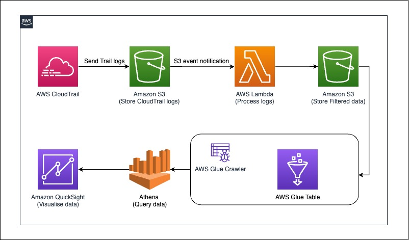

# aws-resource-assessment-iac-automation
This Pattern demonstrate approach for setting up resources assessment capabilities with automated way in AWS using CDK Application. This solution enables the operations team to get resource auditing details in an automated manner. This solution assists operations teams to gather details of all resources deployed in AWS account to a single dashboard which is helpful in following use cases.
1. Identify IAC tools and segregate resources created by different IAC Solutions like terraform, cloudformation, cdk and etc.
2. Fetch resource auditing information
3. Monitor and Cleanup manually created resources
4. Fetching information of manually created resources in order to automate them using IAC solution.

# Prerequisites
- An Activate AWS Account.
- AWS Identity and Access Management Roles and permissions with Access to provision resources.
- QuickSight Account created with access to S3 and Athena. Please refer this [page](https://docs.aws.amazon.com/quicksight/latest/user/signing-up.html) for more help.

# Product Versions
- [AWS CDK](https://aws.amazon.com/cdk/) (version 2.55.1 or higher)
- [Python](https://www.python.org/downloads/release/python-390/) (version 3.9 or higher)

# Target Technology Stack
- [AWS CloudTrail](https://aws.amazon.com/cloudtrail/)
- [Amazon S3](https://aws.amazon.com/s3/)
- [AWS Lambda](https://aws.amazon.com/lambda/)
- [Amazon Athena](https://aws.amazon.com/athena/)
- [AWS Glue Crawler](https://docs.aws.amazon.com/glue/latest/dg/add-crawler.html)
- [AWS Glue Catalog](https://docs.aws.amazon.com/glue/latest/dg/catalog-and-crawler.html)
- [Amazon Quicksight](https://aws.amazon.com/quicksight/)

# Target Architecture
The AWS CDK code will deploy all the resources in order to setup resource assessment capabilities in AWS account.



# Automation and Scale
This solution can be scaled from one AWS account to multiple AWS account or at organizations level to fetch resources auditing details for all the required resources.

# Tools
- [AWS CDK](https://aws.amazon.com/cdk/) - The AWS CDK lets you build reliable, scalable, cost-effective applications in the cloud with the considerable expressive power of a programming language.
- [AWS CloudFormation](https://docs.aws.amazon.com/AWSCloudFormation/latest/UserGuide/Welcome.html) – AWS CloudFormation is an infrastructure as code (IaC) service that allows you to easily model, provision, and manage AWS and third-party resources.

# Code
The code repository contains the following files and folders:

- [infrastructure-assessment-tool-iac](./) -  contains AWS CDK code to deploy resources required for Resource Assessment Infrastructure tool.
- [cdk.out/ResourceIaCStack.template.json]() - contains CloudFormation template used by the product.
- [lib](./lib/) - Contains all CDK construct python files used to create AWS resources.
- [src/lambda_code](./src/lambda_code/) - Contains Python code which is to be executed in the AWS Lambda function.
- [requirement.txt](./requirements.txt) - Contains list of all python dependencies needs to be installed.

# Prerequisites
Make sure you have AWS CDK Toolkit installed on your Terminal. To check execute below command:
```
cdk --version
```
If AWS CDK Toolkit is not installed then execute below command
```
npm install -g aws-cdk@2.55.1
```
If AWS CDK Toolkit version is lower than 2.55.1 then update to 2.55.1 or higher
```
npm install -g aws-cdk@2.55.1 --force
```

# Setup your environment
1. Pull the repo in your local by executing below command:
    ```bash
    git clone https://gitlab.aws.dev/gcci-serverless/infrastructure-assessment-tool/infrastructure-assessment-tool-iac
    ```
    This step creates a folder named `infrastructure-assessment-tool-iac`.

2.  To setup python virtual environment and install required dependencies execute below commands:
    ```bash
    cd infrastructure-assessment-tool-iac
    python3 -m venv .venv
    source .venv/bin/activate
    pip install -r requirements.txt
    ```
3. Execute below command to setup AWS CDK environment and synth CDK code. Learn more about AWS CDK [here](https://docs.aws.amazon.com/cdk/v2/guide/hello_world.html).
    ```bash
    cdk bootstrap aws://ACCOUNT-NUMBER/REGION
    cdk synth
    ```

## Set up AWS credentials in Terminal
Export the following variables which refer to the AWS Account and region where the stack will be deployed:

export CDK_DEFAULT_ACCOUNT=<12 Digit AWS Account Number>

export CDK_DEFAULT_REGION=

AWS Credentials for CDK can be provided through environment variables.

## Configure and Deploy the Resource Assessment Tool
Deploy Resources in AWS Account using CDK.

1.  In the root of this repository, provide inputs required to run cdk in [cdk.json](./cdk.json) file for s3_context, ct_context, kms_context, lambda_context, glue_context and qs_context. There values define resource configurations and nomenclature. Defaults values are set and can be changed if required.

    *Note: You might see S3 already exist error while running cdk deploy so make sure to provide unique names in s3_context under "ct" and "output" section.*

    To deploy resources use below CDK command:

    ```bash
    cdk deploy
    ```

2. After executing the above command, it will create AWS CloudTrail resource to trail the data in Amazon S3 bucket. This trail logs will be processed by AWS Lambda function and store the filtered results in output S3 bucket and this results are ready to be consumed by Amazon Athena And Amazon quicksight service.
3. [AWS Glue Crawler](https://docs.aws.amazon.com/glue/latest/dg/add-crawler.html) is used to keep the data schema dynamic. It creates and update partitions in [AWS Glue catalog table](https://docs.aws.amazon.com/athena/latest/ug/querying-glue-catalog.html) by running it on  periodically as defined by AWS Glue Crawler scheduler. Once the data is available in output Amazon S3 bucket then follow below steps to execute AWS Glue Crawler.

    *Note: As per the configuration in AWS CDK code, AWS Glue Crawler is scheduled to run at particular time. It can also run on-demand basis.*

    You can run using below commands to create table schema for testing:
     - Go to [AWS Glue console](console.aws.amazon.com/glue/home)
     - From the left pane select `Crawlers` under `Data Catalog` section.
     - Select crawler with name `iac-tool-qa-resource-iac-json-crawler`.
     - Run the crawler and wait for its execution.
     - After successful execution, it will create a glue catalog table which will be used by AWS Quicksight to visualize the data.

4. Deploy Quicksight construct -
*Note: Step#3 must be executed before proceeding for this step.*
Uncomment the code present between comments `#Quicksight setup - start` and `#Quicksight setup - ends`(which creates `Quicksight DataSource` and `Quicksight DataSet` in quicksight account) in [resource_iac_tool_stack.py](./lib/resource_iac_tool_stack.py). After uncommenting it execute below command for deploying changes.
    ```bash
    cdk deploy
    ```
5. To create AWS Quicksight dashboard follow below steps:

    *Note: [AWS Quicksight](https://aws.amazon.com/quicksight) is a paid service, please go through [AWS Quicksight pricing](https://aws.amazon.com/quicksight/pricing/) before creating analysis and dashboard.*

    Refer this [page](https://docs.aws.amazon.com/quicksight/latest/user/creating-an-analysis.html) to get understand about AWS QuickSight analysis creation.

    To create a sample analysis for this solution please follow steps:
    - Go to AWS QuickSight [console](quicksight.aws.amazon.com) and [select region](https://docs.aws.amazon.com/quicksight/latest/user/customizing-quicksight.html) where resources are deployed.
    - From the left pane select `Datasets` and validate if dataset named `ct-operations-iac-ds` has been created in AWS Quicksight dataset. If not then please re-visit [Step 4](#configure-and-deploy-the-resource-assessment-tool#4).
    - Select dataset `ct-operations-iac-ds` and click on `USE IN ANALYSIS`.
    - Select the sheet with default setting.
    - select the respective columns from the field list on left side.
    - After selecting the required columns select the appropriate visual to view the data.
    - Learn more about different visual types supported by AWS QuickSight by visiting this [page](https://docs.aws.amazon.com/quicksight/latest/user/working-with-visual-types.html).


## Clean up all AWS Resources in Solution
```bash
cdk destroy
```
*Note: Amazon S3 buckets needs to be removed manually after deleting all S3 objects from the buckets. Please refer this [page](https://docs.aws.amazon.com/AmazonS3/latest/userguide/delete-bucket.html) for more help.

## Contributors
- Sandeep Gawande
- Naveen Suthar
- Manish Garg


## Useful commands

 * `cdk ls`          list all stacks in the app
 * `cdk synth`       emits the synthesized CloudFormation template
 * `cdk deploy`      deploy this stack to your default AWS account/region
 * `cdk diff`        compare deployed stack with current state
 * `cdk docs`        open CDK documentation